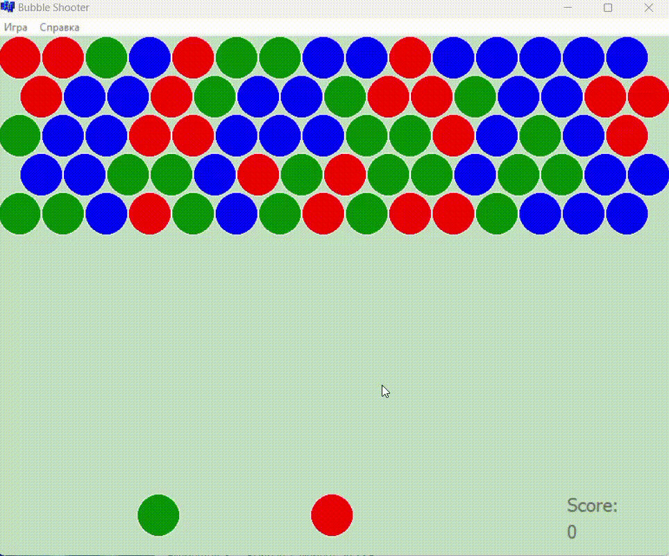

# 🎯 Bubble Shooter

## 🧩 Описание

Программа представляет собой реализацию классической аркадной игры **Bubble Shooter**.  
Цель игрока — **очистить игровое поле от шариков**, объединяя их в группы по **три и более** одного цвета. При совпадении группа исчезает.
В игре имеется 3 уровня сложности.

---

## 🎮 Управление

- **Наведение**: перемещение мыши изменяет траекторию выстрела.
- **Выстрел**: нажмите **левую** или **правую** кнопку мыши, чтобы запустить шарик.

---

## 🖼️ Интерфейс

---

## 💻 Технические детали

- **Язык**: C++
- **Среда**: Borland C++ Builder 10.0
- **GUI-библиотека**: VCL (Visual Component Library)
- **Тип проекта**: Windows-приложение
